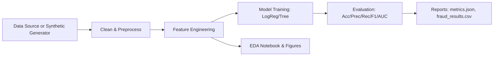

## Transaction Pattern Analysis & Fraud Flagging

End-to-end, portfolio-ready project for analyzing transaction patterns and flagging fraudulent activity using Python 3.11, pandas, scikit-learn, and Jupyter.

### Features
- Synthetic dataset generator (if no real data)
- Cleaning, encoding, and scaling pipelines
- Feature engineering: per-customer aggregates and category ratios
- Models: Logistic Regression and Decision Tree
- Evaluation: accuracy, precision, recall, F1, ROC-AUC
- Reports: metrics JSON and tidy CSV for BI tools (Power BI/Tableau)
- Notebooks for EDA and Modeling
- Lightweight CLI: `python -m src.train --model logreg|tree`

### Project Structure
```
src/
  data.py          # Data loading/generation
  features.py      # Feature engineering transformers
  models.py        # Preprocessing + model pipelines
  metrics.py       # Metrics and report export
  cli.py           # Arg parsing helpers
  train.py         # CLI entrypoint
notebooks/
  01_eda.ipynb
  02_modeling.ipynb
reports/
  figures/
data/
```

### Setup
1) Python 3.11 recommended. Create a virtual env and install:
```bash
python3 -m venv .venv && source .venv/bin/activate
pip install -e .
```

2) Optional dev tools:
```bash
pip install -e .[dev]
```

### Quickstart
Generate synthetic data, train a model, and export reports:
```bash
python -m src.train --model logreg --generate --n_rows 20000 --seed 42
```
Outputs:
- `reports/metrics.json`
- `reports/fraud_results.csv`

### Workflow Diagram


### Business Insights (Examples)
- High-value transactions during unusual hours have elevated fraud risk.
- Customers with sudden spikes in new merchant categories may indicate account takeover.
- Category ratios (e.g., digital goods vs. groceries) can improve early fraud detection.

### Notebooks
- `notebooks/01_eda.ipynb`: Explore distributions, categories, temporal patterns, and anomalies.
- `notebooks/02_modeling.ipynb`: Train/compare Logistic Regression vs Decision Tree and plot ROC.

### Databricks Variant
See `databricks/transaction_fraud_pipeline.py` for a scalable notebook-style pipeline.

### Power BI
Import `reports/fraud_results.csv`. Suggested visuals:
- ROC curve snapshot (from notebook)
- Summary KPIs (precision/recall/F1)
- Category/time heatmaps for fraud rates
- Top risky customers/merchants by predicted probability

### License
MIT


