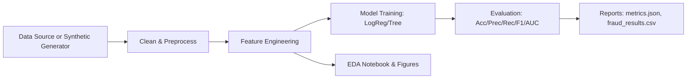

## Transaction Pattern Analysis & Fraud Flagging

End-to-end, portfolio-ready project for analyzing transaction patterns and flagging fraudulent activity using Python 3.11, pandas, scikit-learn, and Jupyter. It generates or ingests transaction data, cleans and engineers features, trains models, evaluates performance, and exports dashboard-ready outputs and figures.

### Why this project?
- Demonstrates a realistic fraud detection workflow from data to deployment-ready artifacts.
- Clean separation of concerns (`src/` modules) with CLI and notebooks for exploration.
- BI-ready CSV and figures you can drop into Power BI/Tableau.

---

## Tech Stack
- Python 3.11
- pandas, numpy, scikit-learn
- matplotlib, seaborn
- Jupyter (Lab/Notebook)
- Databricks (optional large-scale variant)

---

## Project Structure
```
src/
  data.py          # Data loading/saving + synthetic generation
  features.py      # Feature engineering transformers
  models.py        # Preprocessing + model pipelines (LogReg, Tree)
  metrics.py       # Metrics + reports export (JSON, CSV)
  cli.py           # CLI argument parsing
  train.py         # CLI entrypoint (python -m src.train)
notebooks/
  01_eda.ipynb     # Exploratory Data Analysis
  02_modeling.ipynb# Model training/compare/ROC
databricks/
  transaction_fraud_pipeline.py  # Notebook-style pipeline for DBX
reports/
  metrics.json     # Evaluation metrics
  fraud_results.csv# BI-ready tidy results
  figures/         # PNG figures (EDA & ROC)
data/
  transactions.csv # Optional user-provided data
```

---

## Data Schema
The dataset contains one row per transaction:
- `transaction_id` (int/str): Unique transaction identifier
- `customer_id` (int/str): Unique customer identifier
- `amount` (float): Transaction amount
- `merchant_category` (str): Category label (e.g., groceries, travel)
- `time_of_day` (str): One of {morning, afternoon, evening, night}
- `location` (str): Region/state code
- `is_fraud` (0/1): Target variable indicating fraud

If you don’t have real data, the project can generate synthetic data with realistic patterns and noise.

---

## Synthetic Data Generation (how it works)
`src/data.py::generate_synthetic_transactions` creates realistic patterns:
- Non-uniform category mix (e.g., groceries, restaurants are more frequent)
- Amounts sampled via lognormal per-category scales with rare high-value outliers
- Higher fraud risk for certain categories (electronics, travel, digital_goods), at evening/night, and for unusually high amounts
- Small proportion of missing values in categorical and numeric columns to mimic real-world data

---

## Feature Engineering
Implemented in `src/features.py`:
- Simple cleaning (`SimpleCleaner`):
  - Numeric imputation (median) for `amount`
  - Categorical imputation with constant "missing"
- Customer aggregates (`CustomerAggregationTransformer`):
  - `cust_txn_count`, `cust_avg_amount`, `cust_std_amount`
  - Per-customer category ratios: `cust_cat_ratio_<category>`

These features are joined back to each transaction prior to modeling.

---

## Modeling
Pipelines in `src/models.py`:
- Preprocessing (`ColumnTransformer`):
  - Standardize numeric features
  - One-hot encode categorical features
- Models:
  - Logistic Regression (`--model logreg`)
  - Decision Tree (`--model tree`)

Both models run within a single `sklearn` `Pipeline`, ensuring consistent preprocessing at fit/predict time.

---

## Metrics & Reports
Computed in `src/metrics.py` and exported by `src/train.py`:
- Metrics: `accuracy`, `precision`, `recall`, `f1`, `roc_auc`
- Saved to: `reports/metrics.json`
- Predictions CSV: `reports/fraud_results.csv` with columns:
  - `transaction_id`, `customer_id`, `amount`, `merchant_category`, `time_of_day`, `location`, `y_true`, `y_pred`, `y_prob`

Figures saved to `reports/figures/`:
- `amount_distribution.png`
- `fraud_rate_by_merchant_category.png`
- `fraud_rate_by_time_of_day.png`
- `fraud_rate_by_location.png`
- `heatmap_amount_deciles_time.png`
- `roc_curve_logreg_vs_tree.png`

---

## Setup
1) Create and activate a virtual environment (Python 3.11):
```bash
python3 -m venv .venv && source .venv/bin/activate
```

2) Install the package:
```bash
pip install -e .
```

3) Optional dev tools:
```bash
pip install -e .[dev]
```

---

## Usage (CLI)
Generate synthetic data (if missing), train a model, and export reports:
```bash
# Logistic Regression
python -m src.train --model logreg --generate --n_rows 20000 --seed 42

# Decision Tree
python -m src.train --model tree --generate --n_rows 20000 --seed 42
```

CLI options:
- `--model {logreg,tree}`: Choose model type
- `--data_csv PATH`: Use a specific CSV; default is `data/transactions.csv`
- `--generate`: Generate synthetic data when CSV missing
- `--n_rows INT`: Number of rows for synthetic data
- `--seed INT`: Random seed for reproducibility
- `--test_size FLOAT`: Train/test split size (default 0.2)

Outputs:
- `reports/metrics.json`
- `reports/fraud_results.csv`

---

## Using Your Own Data
Place your CSV at `data/transactions.csv` or pass `--data_csv path/to/file.csv`.

Required columns:
- `transaction_id`, `customer_id`, `amount`, `merchant_category`, `time_of_day`, `location`, `is_fraud`

Run:
```bash
python -m src.train --model logreg --data_csv data/transactions.csv
```

---

## Notebooks
- `notebooks/01_eda.ipynb`: EDA on the dataset, including distributions, category/time/amount insights, and saved figures.
- `notebooks/02_modeling.ipynb`: Train and compare models, compute metrics, and plot ROC curves. Optionally re-export results to `reports/`.

Launch:
```bash
python -m jupyter lab
```

---

## Databricks (Large-Scale)
Import `databricks/transaction_fraud_pipeline.py` as a Python notebook in Databricks.
- Optional widget: `n_rows` (defaults to 200000 in the script)
- Saves outputs to `/dbfs/FileStore/fraud_pipeline/`
- For true scale, consider converting feature engineering and models to Spark ML or use sampling.

---

## Power BI / Tableau
Use `reports/fraud_results.csv` as the data source.
Suggested visuals:
- KPIs: Precision, Recall, F1, ROC-AUC (from `metrics.json`)
- ROC curve image (`roc_curve_logreg_vs_tree.png`)
- Fraud rate by category/time/location (bar charts)
- Heatmap of amount deciles by time of day
- Top predicted risky customers/transactions by `y_prob`

---

## Makefile Shortcuts
```bash
make setup       # pip install -e .
make install     # pip install -e .[dev]
make run-logreg  # run logreg with generation
make run-tree    # run decision tree with generation
make clean       # remove caches and generated reports/data
```

---

## Troubleshooting
- PEP 668 / externally-managed environment error:
  - Create a venv: `python3 -m venv .venv && source .venv/bin/activate`
  - Then `pip install -e .`
- Import errors in notebooks:
  - Ensure the venv kernel is selected in Jupyter Lab/Notebook
- Empty reports folder:
  - Run the CLI again with `--generate` or ensure `--data_csv` points to a valid file

---

## FAQ
**Q: Is the synthetic data realistic?**
A: It encodes plausible risk signals (category, time of day, high amounts, region interactions) and noise/missingness, suitable for demos and prototyping.

**Q: Can I add more models?**
A: Yes. Add to `build_full_pipeline` in `src/models.py` and extend CLI choices.

**Q: How do I change feature engineering?**
A: Modify `src/features.py` to add/remove aggregates or build new transformers.

**Q: Can I run this at scale?**
A: Use the Databricks variant and consider porting to Spark ML or use sampling.

---

## Business Insights (Examples)
- High-value transactions during unusual hours have elevated fraud risk.
- Customers with sudden spikes in new merchant categories may indicate account takeover.
- Category ratios (e.g., digital goods vs. groceries) can improve early fraud detection.

---

## Workflow Diagram


---

## License
MIT

---

## Component-by-Component Guide (What each part does)

This section explains every key folder and file in simple terms, plus how they work together.

### data/
- `data/transactions.csv`
  - The main dataset used by the CLI and notebooks.
  - If you don’t provide this file, the program will generate a synthetic one automatically (when `--generate` is used or via `ensure_dataset`).
  - Schema columns: `transaction_id, customer_id, amount, merchant_category, time_of_day, location, is_fraud`.
  - You can replace it with your own real data as long as the schema matches.

### databricks/transaction_fraud_pipeline.py
- A Databricks-ready, notebook-style Python script.
- What it does step-by-step:
  1) Creates synthetic transactions (or adapt to read from a Delta table).
  2) Splits into train/test.
  3) Builds the same sklearn pipeline as the local CLI (feature engineering + model).
  4) Trains Logistic Regression.
  5) Computes metrics and saves outputs to `/dbfs/FileStore/fraud_pipeline/`.
- How to use:
  - Import as a notebook in Databricks.
  - Optionally set a `n_rows` widget.
  - Run all cells; download `metrics.json` and `fraud_results.csv` from DBFS if needed.
- How to scale:
  - For very large data, consider sampling or porting the pipeline to Spark ML. The current script is pandas/sklearn for clarity and portability.

### reports/
- `reports/metrics.json`
  - Key evaluation metrics for the last run.
  - Keys: `accuracy`, `precision`, `recall`, `f1`, `roc_auc`.
- `reports/fraud_results.csv`
  - Tidy, BI-ready output for dashboards.
  - Columns:
    - Inputs: `transaction_id, customer_id, amount, merchant_category, time_of_day, location`
    - Labels and predictions: `y_true, y_pred, y_prob`
  - Typical use: import into Power BI/Tableau for KPIs, ROC snapshots, and risk lists.
- `reports/figures/`
  - `amount_distribution.png`: How transaction amounts are distributed (most small, some large outliers).
  - `fraud_rate_by_merchant_category.png`: Which categories see more fraud.
  - `fraud_rate_by_time_of_day.png`: Which times of day are riskier.
  - `fraud_rate_by_location.png`: Which regions are riskier.
  - `heatmap_amount_deciles_time.png`: Fraud rate by amount bucket and time of day.
  - `roc_curve_logreg_vs_tree.png`: Model comparison of fraud discrimination.

### src/
Reusable, testable code used by both CLI and notebooks.

- `src/data.py`
  - `DataPaths`: Small helper storing where your CSV lives (default `data/transactions.csv`).
  - `generate_synthetic_transactions(n_rows, seed, ...)`:
    - Produces realistic transactions with a non-uniform category mix.
    - Amounts use lognormal distributions per category, with occasional high-value outliers.
    - Fraud risk increases at evening/night, for certain categories (electronics/travel/digital_goods), and with high amounts.
    - Produces a binary `is_fraud` using a logistic function on those risk signals.
    - Introduces a small fraction of missing values to simulate real-world imperfections.
  - `ensure_dataset(paths, generate_if_missing, ...)`:
    - If the CSV is missing and generation is allowed, it creates and saves the synthetic dataset.
  - `save_dataframe_to_csv`, `load_dataframe_from_csv`: Simple I/O helpers.

- `src/features.py`
  - `SimpleCleaner(numeric_columns, categorical_columns)`:
    - Imputes numeric missing values with the median (e.g., `amount`).
    - Imputes categorical missing values with the constant string "missing".
  - `CustomerAggregationTransformer`:
    - Computes per-customer aggregates: `cust_txn_count`, `cust_avg_amount`, `cust_std_amount`.
    - Computes per-customer category ratios: `cust_cat_ratio_<category>` (share of transactions in each category).
    - Merges all of the above back onto each transaction row.

- `src/models.py`
  - `PreprocessConfig`:
    - Lists which columns are numeric vs categorical for preprocessing.
  - `build_preprocess_pipeline()`:
    - Standardizes numeric features and one-hot encodes categoricals using `ColumnTransformer`.
  - `build_full_pipeline(model_type)`:
    - End-to-end sklearn `Pipeline`: cleaning → customer features → preprocess → model.
    - `model_type='logreg'`: Logistic Regression with higher `max_iter`.
    - `model_type='tree'`: Decision Tree with `max_depth=8` for interpretability.

- `src/metrics.py`
  - `compute_classification_metrics(y_true, y_pred, y_prob)`:
    - Returns accuracy, precision, recall, F1, ROC-AUC.
  - `ReportPaths` + `export_metrics_json` + `export_results_csv`:
    - Ensures `reports/` exists, writes metrics and the tidy results CSV used by BI.

- `src/cli.py`
  - `build_train_arg_parser()`:
    - Defines CLI flags: `--model {logreg,tree}`, `--data_csv`, `--generate`, `--n_rows`, `--seed`, `--test_size`.

- `src/train.py`
  - `load_or_generate_dataset(...)`:
    - Uses `ensure_dataset` to either load the CSV or generate it.
  - `run_training(model_type, df, test_size, seed)`:
    - Splits data (stratified), fits the pipeline, predicts `y_pred` and `y_prob`.
    - Computes metrics and returns both the `results_df` and `metrics_dict`.
  - `main()`:
    - Parses CLI args, runs training, writes `reports/metrics.json` and `reports/fraud_results.csv`.
    - The CSV includes only columns most relevant for BI consumption.

### notebooks/01_eda.ipynb
- Purpose: exploratory data analysis.
- What it shows:
  - Dataset overview (`head`, `describe`) and class balance.
  - Amount distribution (histogram + boxplot) to see typical spend and outliers.
  - Fraud rate by merchant category, time of day, and location (bar charts).
  - Heatmap: fraud rate by amount deciles x time of day.
  - Saves a sample figure under `reports/figures/`.
- How to run:
  - `python -m jupyter lab` → open the notebook → run all cells.

### notebooks/02_modeling.ipynb
- Purpose: model training and comparison within a notebook.
- What it does:
  - Loads/ensures data, splits train/test.
  - Trains Logistic Regression and Decision Tree using the same pipeline as the CLI.
  - Computes metrics for both and shows a side-by-side ROC curve.
  - Optionally exports a results CSV and a combined metrics JSON to `reports/`.
- How to run:
  - `python -m jupyter lab` → open the notebook → run all cells.

---

## How the pieces fit together (at a glance)
- The CLI (`src/train.py`) and notebooks call into `src/data.py` to load or synthesize transactions.
- Data is cleaned and enriched by transformers in `src/features.py`.
- `src/models.py` builds the full sklearn pipeline (preprocess + model), trained and evaluated in one go.
- `src/metrics.py` exports standardized metrics and a tidy CSV ready for BI tools.
- `reports/` collects artifacts (JSON, CSV, PNG figures) for stakeholder-facing outputs.

